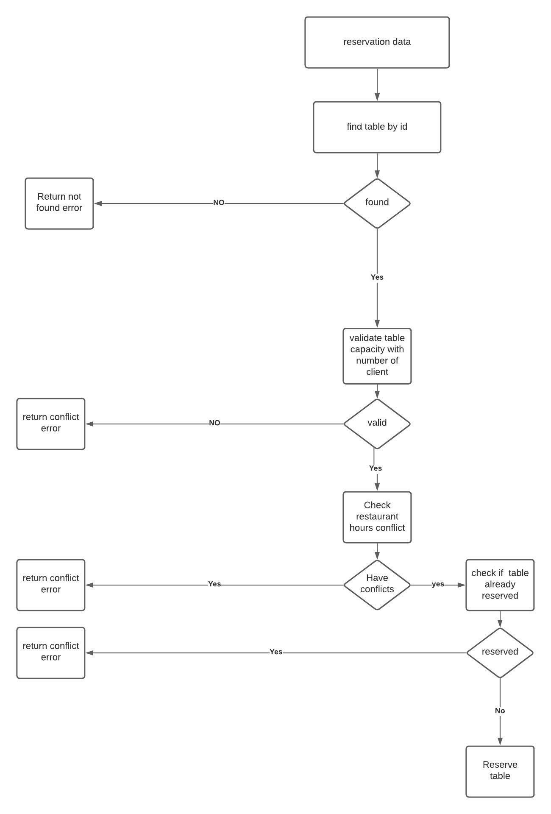

# Reservation BACKEND SYSTEM 🚀.
This is a Simple Backend system handles a restaurant reservation with time slots 🌮.

# Project structure 
in this project I have used a new software architecture called model route service controller which is basically separating database entity
inside a folder called model and a pure database logic and quires inside folder called services and the controller will be focused on the business logic only and finally router to 
send the response to clients, since I believe separation of concerns is important so when we write business logic code we are trying to avoid any database code to stay focused on the main problem.

# Technology used to develop the project 😍🔥:
* I have used NODEJS with expressjs and typescript as backend framework.
* I have used ORM library called TypeORM to write POSTGRES queries and use the main language as an abstraction layer of dealing with databases.
* I have used Jest and supertest for unit testing to test each endpoint with its restriction such as authentication,validation, level of authority.
* I have used Joi it is a library to validate body requests before hitting the controllers.
* I have used JWT to secure server endpoints from benign consumed by anyone does not have the authority.
* I have dockerized the server to make the life easier for tester, since it works on a container it is 100% will work in other container 🐳.

# How to run the project: 
 before running the project make sure you have docker installed in your own machine,
 I have chosen docker to avoid tester to do manual work such as create database or config its env to make it work on his local machine.
 just make sure before following me that you do not have docker containers running on a port conflicting with this project so feel free to change the ports!
 * once you cloned the project in the root directory run the following commands
 * `docker-compose build`, to build the docker-compose file and set up an image of the server and an image of the postgresql db.
 * once the command executed then write `docker-compose up -d` without logs it will run on the background, or you can run it as `docker-compose up` to view logs directly.
 * if you ran the docker compose on background mode, to view the logs type `docker-compose logs`.

# How to test the project ?🐳
to test the project while you are running it on a container, go to other tap in your terminal then write the following commands.
* `docker ps` to see the running containers
* take the id of the server container then type in the terminal `docker exec -it <CONTAINER-ID> sh`
* then it takes you to the container at the working dir which there is the app.
* then simply you have many commands you can view them in `package.json` file.
* to do unit testing for all endpoints simply just write `npm run test`, it will run all the tests and at the end it will give you a coverage statistics.
Congratulations you have tested all the functionalities of the project 🤩.
Feel free to explore the tests written all the code is documented for each case what should it do and what.

# How the problem was solved 🤓: 
The problem mainly focused on how to manage time slots and prevent any reservation conflict happened with restaurant timing or other reservation timing.
I managed to create the following entities in the database:
* restaurant model which will have restaurant name, tables,working hours. 
* table model which will holds the restaurant info, reservations info, time slots table does have for reservation.
* timeSlot model which will have time info and table info to manage the reservation process and can check for conflicts and future reservations.
* user model which will have employee number and its role whether admin or employee and finally his password. 

# Algorithm procedure 🤝:
below a flowchart diagram that explain the reservation process

# endpoints:
there are 6 based routers: 
* admin route: holds admin functionality such as listing all reservations with some additional options, and creating a user with authority level of employee.
* auth route: holds the functionality of authentication, to obtain a jwt token sent within the response header.
* index route: router to inject some basic endpoints such as checking backend health. 
* reservation route: router responsible for reservation collection model GET/PUT/DELETE/POST.
* restaurant route: router responsible for restaurant collection model GET/PUT/DELETE/POST.
* table route:  router responsible for table collection model GET/PUT/DELETE/POST.
* users route: router responsible for table collection model GET/PUT/DELETE/POST.

# Validations:
All routers have middlewares to check and validate before hitting the business logic and database status.
so to consume the api you must be authenticated and some endpoints you must be authorized to consume the resources

# Testing with POSTMAN: 
To be able to test with post man you have to be authenticated, so first thing you do is to create an admin from the admin endpoint, `/admin/addAdmin`, then hit the endpoint login `api/auth/login` and obtain the token from the response header and consume it as `auth` header on all your requests.

